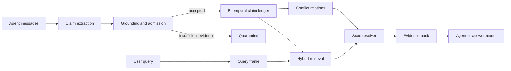

# STAC-Mem

**Evidence-carrying bitemporal memory for long-running AI agents.**

[中文说明](README.zh-CN.md) | [Architecture](docs/01_ARCHITECTURE.md) | [Runbook](docs/04_RUNBOOK.md) | [Predicate schema](docs/07_PREDICATE_SCHEMA.md) | [Agent tools](docs/08_AGENT_TOOLS.md)

STAC-Mem is a local-first memory service for agents that interact with the same user over time. It
stores conversational facts as versioned claims, keeps the evidence behind every state change, and
resolves the state that is applicable to a query's time and place.

It is useful when an agent must distinguish between statements that are all relevant but not all
currently valid:

```text
2024-08-01  I joined Northwind Labs as a product designer.
2024-10-15  I left Northwind Labs and joined Contoso Health as a senior product designer.
```

A similarity search can retrieve both statements. STAC-Mem additionally answers which statement is
current, which one was valid on a historical date, whether the newer statement actually supersedes
the older one, and where the decision came from.

## Design Goals

- **Preserve evidence.** State changes never erase their source messages or previous versions.
- **Separate event time from knowledge time.** A fact may become known after the period it describes.
- **Treat place as scope.** Location-specific preferences may coexist instead of overwriting one another.
- **Resolve conflicts explicitly.** Contradiction, correction, retraction, transition, and coexistence
  are represented as typed relations.
- **Keep retrieval and truth selection separate.** Retrieval finds plausible evidence; a deterministic
  resolver decides which evidence applies to the requested view.
- **Fail safely.** Unsupported updates are quarantined and unresolved conflicts remain visible.
- **Keep semantics application-owned.** A validated predicate registry controls which text-state
  slots may update active memory; model-generated names cannot acquire write authority.

## Architecture



The write path and read path deliberately meet at the ledger rather than at a generated summary.
This keeps source evidence, state transitions, and query decisions independently inspectable.

## How It Works

### Evidence-carrying claims

Each claim records:

| Field | Meaning |
|---|---|
| `owner_id` | Memory namespace and isolation boundary |
| `subject`, `predicate`, `object_value` | Canonical state slot and value |
| `valid_start`, `valid_end` | When the fact applies in the represented world |
| `transaction_start`, `transaction_end` | When the memory system knew that version |
| `place` | Optional geographical or contextual scope |
| `source_session_id`, `source_message_ids`, `source_content` | Auditable provenance |
| `status`, `version` | Materialized state in the version chain |

The ledger is append-preserving. An update can mark an earlier claim as superseded without deleting
it, so historical and knowledge-time queries remain possible.

### Grounded admission

Language models may propose structure, but they do not directly mutate the active state. STAC-Mem
checks that the proposed value and transition evidence are present in the source message, that the
subject and slot align, and that temporal boundaries are coherent. A proposal that cannot satisfy
the contract is retained as an auditable rejection instead of silently becoming truth.
Only dates grounded in the source can set claim validity bounds. An unsupported model date is
cleared; an undated past-only state is kept as a quarantined candidate. Directional updates verify
that the proposed current value is the destination, rather than the value being left behind.
Dates and change cues bind to the supporting proposition rather than leaking across unrelated
clauses. Undated present states keep an unknown onset and a separate evidence eligibility floor,
so they cannot answer questions about a time before the supporting message. A dated historical
state can be retained as a day observation without claiming an onset or termination.
Leading dates can cover connected change events, with auditable scope boundaries. A separate
endpoint check prevents an old state's cutoff from becoming the new state's end date.
Independent dates and time modifiers veto date inheritance even when their meaning is not yet
supported; the certificate preserves the blocking source spans instead of guessing a boundary.
Layered temporal evidence checks also cover bare years, periods and relative durations, with
per-occurrence accounting for parsed cues, literal entity names and unresolved evidence.
Grounding uses the full authenticated message and code-selected proposition context. Positive model
hints cannot promote a question, hypothetical, negated statement or another person's experience to
user state, and a proposed transition needs independently detected change evidence. Negative hints
can veto a candidate. See the [grounding contract](docs/09_GROUNDING_CONTRACT.md) for supported rules,
audit fields and integration examples.
Existing source-linked history can be audited and explicitly rebuilt under the current policy in a
separate database, including intact saved pending batches. See [history upgrades](docs/10_HISTORY_UPGRADE.md).

### Online conflict graph

New claims are compared within canonical functional slots. The conflict engine creates relations
such as `supports`, `supersedes`, `corrects`, `retracts`, `contradicts`, and `coexists`. Relations
carry a reason and detector identity, making state changes explainable without rewriting history.

### Query-aware resolution

Search combines lexical, embedding, temporal, spatial, validity, and confidence signals. The
resolver then produces a requested view:

- `current`: the active value at the query time;
- `as-of`: the value valid at a historical time;
- `known-as-of`: the value the system had learned by a knowledge cutoff;
- `history`: the ordered version chain.

The returned evidence pack includes selected claims, suppression decisions, warnings, provenance,
and diagnostics. An answer model only sees evidence that survived deterministic state resolution.

## Features

- SQLite-backed source store and bitemporal claim ledger.
- Incremental conflict detection and append-preserving version history.
- Current, historical, knowledge-cutoff, and history views.
- Place-scoped state coexistence and spatial filtering.
- FTS5 plus embeddings with optional reranking.
- Database-bound embedding identity to prevent cross-model vector-space contamination.
- Idempotent session receipts, owner isolation, and explicit retry behavior.
- Atomic prepared recovery with commit-time journal cleanup by default.
- Configurable, database-bound single-value text predicates with global or place scope.
- Application-owned place identities that unify trusted multilingual aliases without accepting
  model-invented geography.
- Owner-bound read-only function tools for agent loops; the host records real user messages.
- Visible multilingual context-budget estimates instead of a hidden characters-per-token rule.
- Python SDK, command-line interface, and loopback FastAPI service.
- Deterministic offline mode for local development without an API key.

## Quick Start

Python 3.11 or newer is required.

Chat and embedding endpoints can be configured independently with the
`openai_compatible` provider. See [provider configuration](docs/05_PROVIDERS.md).
For agent-loop integration and read-only failure diagnosis, see the
[cookbook](docs/06_AGENT_COOKBOOK.md) and [runbook](docs/04_RUNBOOK.md).
Applications that need state slots beyond the built-in vocabulary should define them before first
startup; see the [predicate schema guide](docs/07_PREDICATE_SCHEMA.md).
Applications with location-scoped state can similarly configure canonical place identities and
aliases before first startup. The normalized place manifest is bound to the database.

Linux, macOS, or WSL:

```bash
bash scripts/quickstart.sh --dev
```

Windows PowerShell:

```powershell
.\scripts\quickstart.ps1 --dev
```

The command creates `.venv`, installs STAC-Mem, and runs a local lifecycle demonstration without
network calls.

## Command Line

After installation, use the deterministic offline profile:

```bash
stacmem --offline --database runtime/stacmem.sqlite3 status
```

For natural-language ingestion, copy `.env.example` to `.env`, set `DASHSCOPE_API_KEY`, and run:

```bash
stacmem \
  --config configs/standalone_qwen.toml \
  --database runtime/stacmem.sqlite3 \
  remember examples/standalone_session.json

stacmem \
  --config configs/standalone_qwen.toml \
  --database runtime/stacmem.sqlite3 \
  search examples/standalone_query.json
```

## Python SDK

```python
from stacmem.config import AppConfig
from stacmem.models import Message
from stacmem.standalone import StandaloneMemory

config = AppConfig.load("configs/standalone_qwen.toml")
config.runtime.database_path = "runtime/stacmem.sqlite3"

with StandaloneMemory(config) as memory:
    memory.remember(
        owner_id="alex",
        session_id="career-001",
        messages=[
            Message(
                sender_id="alex",
                role="user",
                timestamp=1722513600000,
                content="On August 1, 2024, I joined Northwind Labs.",
            )
        ],
    )
    result = memory.search(
        owner_id="alex",
        query="Where did I work on September 1, 2024?",
    )
```

## Local API

Create `.env` from `.env.example`, fill in `DASHSCOPE_API_KEY`, then start the loopback service:

```bash
bash scripts/start_stacmem.sh
```

Windows:

```powershell
.\scripts\start_stacmem.ps1
```

Open `http://127.0.0.1:8020/docs` for the generated API schema. The bundled server intentionally
binds to loopback; production deployments should add their own authentication, authorization,
rate limiting, backups, and transport security.

## Repository Layout

```text
src/stacmem/   Ledger, grounding, conflict, retrieval, resolver, SDK, CLI, and API
tests/         Unit, integration, recovery, and contract tests
configs/       Offline and provider configurations without secrets
examples/      Example sessions, claims, and queries
scripts/       Setup, service startup, health checks, and release tooling
docs/          Architecture and operating documentation
```

## Build A Source Release

```bash
python scripts/build_release.py
```

The release builder uses an explicit allowlist, checks for likely literal secrets and legacy
identifiers, and writes a hash manifest into the source archive. Local databases, API keys, caches,
generated runs, private research material, and downloaded datasets are excluded.

## Design Principle

> A retrieved memory is evidence, not automatically the current truth.

STAC-Mem keeps candidate discovery broad and state mutation conservative. Models propose semantic
structure; explicit contracts decide whether it may alter memory; deterministic resolution selects
the state view needed by the current query.

## Temporal Contract

The v0.1 temporal contract supports explicit ISO-date structures, not unrestricted natural-language
time inference. Cross-proposition date inheritance requires complete supported clause structures;
an unrecognized modifier leaves bounds unknown, even when no lexical veto was detected.
See [the frozen contract and invariants](docs/11_V01_FREEZE.md).

## License

Apache License 2.0. See [LICENSE](LICENSE).
