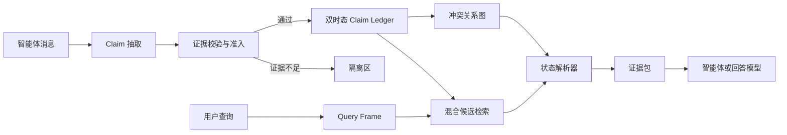

# STAC-Mem

**面向长期交互智能体的证据携带式双时态记忆系统。**

[English](README.md) | [架构设计](docs/01_ARCHITECTURE.md) | [运行手册](docs/04_RUNBOOK.md) | [谓词注册](docs/07_PREDICATE_SCHEMA.md) | [Agent 工具](docs/08_AGENT_TOOLS.md)

STAC-Mem 是一个面向长期交互智能体的本地优先记忆服务。它把对话中的事实保存为带版本的
claim，保留每次状态变化背后的原始证据，并根据查询的时间和地点解析真正适用的状态。

例如，用户先后说：

```text
2024-08-01  我加入 Northwind Labs，担任产品设计师。
2024-10-15  我离开 Northwind Labs，加入 Contoso Health，担任高级产品设计师。
```

相似度检索会认为两条内容都相关，但长期记忆还需要判断：当前值是哪一个、历史日期对应哪
一个、新陈述是否真的覆盖旧状态，以及这个判断来自哪条原始消息。STAC-Mem 将这些语义变成
可执行、可审计的状态规则。

## 设计目标

- **保留证据**：状态变化不删除原始消息和旧版本。
- **区分事实时间与获知时间**：系统可能在事件发生很久以后才获知它。
- **把地点作为作用域**：不同地点的条件偏好可以共存，而不是互相覆盖。
- **显式表达冲突**：矛盾、修正、撤回、迁移和共存都使用类型化关系表示。
- **分离检索与真值解析**：检索负责找候选，确定性解析器负责判断当前查询适用哪个版本。
- **保守失败**：证据不足的更新进入隔离区，未解决冲突会直接暴露给调用方。
- **由应用定义语义**：经过校验的谓词注册表决定哪些文本状态槽可以更新活动记忆，模型临时
  生成的名称不会自动获得写入权限。

## 系统架构



写入链路与查询链路在状态账本处汇合，而不是依赖某份不断覆盖的摘要。因此来源证据、状态
迁移和查询决策可以分别检查。

## 工作原理

### 证据携带式 Claim

每条 claim 记录：

| 字段 | 含义 |
|---|---|
| `owner_id` | 记忆命名空间与隔离边界 |
| `subject`、`predicate`、`object_value` | 规范化状态槽与值 |
| `valid_start`、`valid_end` | 事实在现实世界中的有效时间 |
| `transaction_start`、`transaction_end` | 系统获知该版本的时间 |
| `place` | 可选的地理或上下文作用域 |
| `source_session_id`、`source_message_ids`、`source_content` | 可审计来源 |
| `status`、`version` | 版本链中的物化状态 |

账本采用追加保留语义。新版本可以将旧 claim 标记为已被取代，但不会删除旧值，因此仍能回答
历史时点和知识截止时间查询。

### Grounded Admission

语言模型可以提出结构化候选，但不能直接修改活动状态。STAC-Mem 会验证候选值和迁移证据是否
真实出现在原始消息中，主体和状态槽是否对齐，以及时间边界是否自洽。不满足契约的候选会被
保留为可审计拒绝记录，而不是静默变成事实。
有效时间只能由原始消息中的日期证据确定；模型凭空填写的日期会被清空。没有明确终止时间的
过去式状态会作为隔离候选保留。方向性更新还会验证候选当前值是到达值，而非离开的旧值。
日期和变更动作绑定到对应命题，不跨无关分句传播。无日期的现在状态保留未知起点，并单独记录
证据可用下界，不能回答来源消息之前的历史状态。带明确日期的历史陈述可以保存为当天观察，
而不凭空声称事实何时开始或结束。
前置日期可以覆盖明确相连的变更事件，并记录可审计的作用域。独立的终点检查会阻止旧状态的
截止日期被当成新状态的结束日期，即使分句规则尚未识别某种表达。
目标命题或传播路径出现独立日期、时间修饰时，即使其含义尚不支持，也会阻止日期继承，保留
未知边界及阻止绑定的原文位置，而不是猜测起止日期。
时间证据检查还覆盖裸年份、时间段和相对时长，并逐项区分已解析日期、对象字面名称及未解释
证据；未解释的证据不能获得继承而来的时间权威。
校验使用经过认证的完整原始消息，由代码定位命题及上下文。模型的肯定提示不能把疑问、假设、
否定或他人经历提升为用户事实；状态迁移也需要代码独立识别到变更证据。模型的保守提示可以
否决候选。具体语言规则、审计字段和接入例子见 [Grounding 契约](docs/09_GROUNDING_CONTRACT.md)。
已有来源记录的历史数据也可以先审计，再按当前规则重建到新数据库，包括完整保存的未提交批次。
旧数据库不会被覆盖；操作方法见 [历史升级](docs/10_HISTORY_UPGRADE.md)。

### 在线冲突关系图

新 claim 会在规范化功能槽内与既有版本比较。冲突引擎建立 `supports`、`supersedes`、
`corrects`、`retracts`、`contradicts` 和 `coexists` 等关系。每条关系都保存原因和检测器，
从而在不改写历史的情况下解释状态变化。

### 查询感知的状态解析

搜索综合词法、向量、时间、空间、有效性和置信度信号。解析器随后构造所需视图：

- `current`：查询时刻的当前活动值；
- `as-of`：历史时点有效的值；
- `known-as-of`：系统在知识截止时间之前已经获知的值；
- `history`：按顺序排列的完整版本链。

返回的证据包包含被选 claim、抑制决策、警告、来源和诊断信息。回答模型只能看到通过确定性
状态解析后的证据。

## 已实现能力

- 基于 SQLite 的来源存储与双时态 claim 账本。
- 增量冲突检测和追加保留式版本历史。
- 当前、历史时点、知识截止和完整历史视图。
- 地点作用域共存与空间过滤。
- FTS5、向量检索以及可选 rerank。
- 数据库绑定 embedding identity，阻止不同模型或端点的向量空间被混入同一账本。
- 会话幂等收据、owner 隔离和显式重试语义。
- 原子 prepared recovery，默认在成功提交事务内清理恢复日志。
- 可配置且绑定数据库的单值文本谓词，支持全局或地点作用域。
- 由应用维护并绑定数据库的地点身份，可统一可信的多语言别名，同时拒绝模型虚构的地理信息。
- 绑定 owner 的只读 function tools；真实用户消息由宿主程序写入记忆。
- 可见的多语言上下文预算估算，不再隐藏使用固定字符数换算 token。
- Python SDK、命令行工具和本地 FastAPI 服务。
- 无需 API Key 的确定性离线开发模式。

## 一键运行

需要 Python 3.11 或更高版本。

可通过 `openai_compatible` 分别配置聊天和向量模型的服务地址及密钥环境变量，
见[模型接入说明](docs/05_PROVIDERS.md)。接入智能体循环与只读故障诊断分别见
[集成示例](docs/06_AGENT_COOKBOOK.md)和[运行手册](docs/04_RUNBOOK.md)。
需要扩展内置状态槽时，应在首次创建数据库前完成注册，具体边界见
[谓词注册说明](docs/07_PREDICATE_SCHEMA.md)。
地点作用域应用也应在首次启动前配置稳定的 `place_id`、名称和别名；其规范化清单会绑定到数据库。

Linux、macOS 或 WSL：

```bash
bash scripts/quickstart.sh --dev
```

Windows PowerShell：

```powershell
.\scripts\quickstart.ps1 --dev
```

该命令会创建 `.venv`、安装 STAC-Mem，并在不发起网络请求的情况下运行本地生命周期演示。

## 命令行

安装后可以先使用确定性离线配置：

```bash
stacmem --offline --database runtime/stacmem.sqlite3 status
```

自然语言写入需要将 `.env.example` 复制为 `.env`，填写 `DASHSCOPE_API_KEY`，然后执行：

```bash
stacmem \
  --config configs/standalone_qwen.toml \
  --database runtime/stacmem.sqlite3 \
  remember examples/standalone_session.json

stacmem \
  --config configs/standalone_qwen.toml \
  --database runtime/stacmem.sqlite3 \
  search examples/standalone_query.json
```

## Python SDK

```python
from stacmem.config import AppConfig
from stacmem.models import Message
from stacmem.standalone import StandaloneMemory

config = AppConfig.load("configs/standalone_qwen.toml")
config.runtime.database_path = "runtime/stacmem.sqlite3"

with StandaloneMemory(config) as memory:
    memory.remember(
        owner_id="alex",
        session_id="career-001",
        messages=[
            Message(
                sender_id="alex",
                role="user",
                timestamp=1722513600000,
                content="On August 1, 2024, I joined Northwind Labs.",
            )
        ],
    )
    result = memory.search(
        owner_id="alex",
        query="Where did I work on September 1, 2024?",
    )
```

## 本地 API

从 `.env.example` 创建 `.env`，填写 `DASHSCOPE_API_KEY`，然后启动仅监听本机的服务：

```bash
bash scripts/start_stacmem.sh
```

Windows：

```powershell
.\scripts\start_stacmem.ps1
```

打开 `http://127.0.0.1:8020/docs` 可以查看接口定义。内置服务刻意只绑定 loopback；生产部署
应自行增加认证、授权、限流、备份和传输安全。

## 目录结构

```text
src/stacmem/   账本、grounding、冲突、检索、解析、SDK、CLI 和 API
tests/         单元、集成、恢复与契约测试
configs/       不含密钥的离线与模型配置
examples/      示例会话、claim 与查询
scripts/       安装、服务启动、健康检查和发布工具
docs/          架构与运行文档
```

## 构建源码发布包

```bash
python scripts/build_release.py
```

构建器使用显式白名单，检查疑似明文密钥和遗留标识符，并在发布包中写入文件哈希清单。本地
数据库、API 密钥、缓存、运行结果、私有研究材料和下载数据均不会进入发布包。

## 设计原则

> 被召回的记忆是证据，不自动等于当前真相。

STAC-Mem 让候选发现保持充分，同时让状态修改保持保守。模型提出语义结构，显式契约判断它
是否有权改变记忆，确定性解析器再为当前查询选择正确的状态视图。

## 时间契约

v0.1 支持明确的 ISO 日期结构，不承诺理解任意自然语言时间。跨分句继承日期必须通过完整的
支持结构匹配；即使没有检测出危险词，未知修饰语仍会使时间边界保持 unknown。
详见[冻结契约与正确性约束](docs/11_V01_FREEZE.md)。

## 许可证

Apache License 2.0，详见 [LICENSE](LICENSE)。
