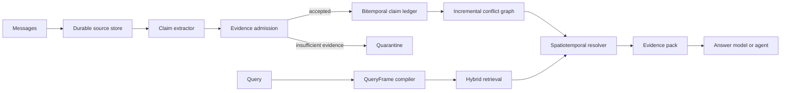

# STAC-Mem Architecture

STAC-Mem treats long-term memory as versioned state rather than a bag of retrieved text. The
runtime owns source persistence, claim extraction, admission, conflict relations, retrieval, and
state resolution.

## Data flow

## Evidence-carrying claims

Every admitted claim retains:

- owner, subject, predicate, and source-grounded object value;
- source session, message identifiers, and proposition evidence;
- valid-time and observation-time bounds;
- optional typed place scope;
- confidence, update kind, status, and version;
- an embedding used for candidate retrieval.

The ledger never needs to destroy an old value to expose a new current value. Typed relations such
as `supports`, `supersedes`, `corrects`, `retracts`, `contradicts`, and `coexists` preserve the
history and the reason for each state transition.

## Write path

The application predicate registry is a shared semantic boundary across the write and query paths.
Extraction, query compilation, admission, conflict classification and resolution use the same
immutable table. Its normalized manifest is bound to the database so a configuration change cannot
silently reinterpret stored state. Unknown relations retain evidence but have no destructive state
authority.

Place identity follows the same trust boundary. The extractor must first ground a literal place
name in the source. Only then may an application-owned registry map that literal alias to a stable
`place_id` and hierarchy. Model-proposed IDs, coordinates, aliases and hierarchies are ignored.
The registry manifest is database-bound because changing an alias can change conflict scope.

1. Persist source messages and a session-content fingerprint.
2. Extract candidate claims from the messages.
3. Verify source references, surface values, factuality, subject alignment, and transition cues.
   Only authenticated user messages can authorize user state; assistant/tool sources remain
   available for audit but their proposed state claims are quarantined.
   The compiler retrieves the full original message by ID. Deterministic source clauses and
   sentence context govern admission; model-selected spans are kept for audit. Model semantic
   hints may veto admission or a transition, but cannot override a negative or unknown check.
4. Normalize temporal and spatial scope. Bind date and change cues to the supporting proposition,
   while retaining outer source context for factuality checks. Unknown onset is distinct from the
   authenticated assertion-time evidence floor; a dated state observation has bounded evidence
   coverage without asserting a state transition.
   An introductory date can dominate connected change events. Local dates and temporal/contrast
   boundaries stop inheritance; an independent endpoint guard prevents an arrival value from
   acquiring an unrelated upper bound even if proposition segmentation is incomplete.
   A separate lexical scan vetoes binding when unconsumed dates or independent time modifiers
   occur in the target or inheritance path, even when their interval semantics are unsupported.
   Certificates retain those signals and original offsets; unsupported bounds stay unknown.
   A separate temporal-evidence accounting module classifies date forms, bare years, relative
   durations and periods, recording each occurrence as parsed, literal-object text or unresolved.
   All detected evidence must be accounted for before a checked proposition can bind a date.
5. Compare the candidate only with prior claims in its canonical functional slot.
6. Commit the claim, relations, and materialized status changes in one SQLite transaction.
7. Return a durable receipt. Identical retries replay the receipt; changed content under the same
   session ID is rejected.

## Query path

The QueryFrame makes temporal intent explicit: `current`, `as-of`, `known-as-of`, or `history`.
Candidate retrieval combines FTS5, embeddings, temporal fit, spatial fit, validity, confidence, and
optional reranking. Retrieval remains broad; the deterministic resolver applies valid-time,
knowledge-time, place-scope, status, and conflict rules before producing an evidence pack.
Temporal scoring, point/interval projection and public conflict comparison share an evidence
eligibility interval. An undated continuing state cannot be projected into the past before its
supporting assertion; source-grounded retrospective bounds remain independent of message recency.
Context truncation uses a deterministic multilingual estimate and reports the method, estimated
size, configured budget and truncation flag. It is not presented as an exact provider tokenizer.

## Consistency and recovery

- A committed source session and claim ledger have explicit local receipts.
- Search reads the committed ledger and provides read-your-writes semantics.
- Incomplete owners are blocked from state operations until explicit recovery.
- Owner IDs are included in every source and claim query.
- Failed zero-claim extraction can be retried explicitly without silently replaying partial writes.
- Extraction and embedding finish before a durable prepared batch is saved. A single SQLite
  transaction then commits all claims, prior-version mutations, conflict relations, claim FTS and
  the committed receipt. Nested ledger operations use savepoints, not independent commits.
- Explicit prepared recovery reuses saved drafts and vectors. Request, payload and state-policy
  fingerprints plus the exact embedding-space fingerprint are checked before replay; model calls
  are not repeated. A prepared batch blocks vector-space rebinding even when no claim exists yet.
- Competing prepared commits/recoveries acquire a SQLite write transaction and recheck the receipt.
  The winner commits; later contenders return the saved response. No time-based lease takeover is
  needed for this stage. Processing without a prepared batch is deliberately not taken over.
- On successful commit, the default `until_commit` policy removes the prepared journal inside the
  same transaction. A failed commit rolls the deletion back, while a lost response replays the
  committed receipt. `forever` retention is available only for explicit audit/debug deployments.
- Prepared recovery compares explicit semantic protocol versions and policy/schema configuration.
  Formatting or comment-only code changes do not invalidate a batch; semantic changes must bump
  the corresponding version.

## Storage

SQLite stores source messages, source-session receipts, claims, conflict relations, FTS indexes,
incomplete prepared batches and recovery attempts. WAL mode permits concurrent reads while preserving
transactional writes. Source acceptance and preparation are durable earlier stages, not part of
the final claim transaction. Historical partial writes from older implementations are not
automatically migrated or repaired. A database-bound embedding identity prevents vectors from
different providers, models, endpoints, dimensions, or declared spaces from being mixed.
Generated databases, datasets, and run artifacts are excluded from the release repository.

`StandaloneMemory` supplies the source store and receipt lifecycle and is the application SDK.
`StacMemory.from_app_config` is the advanced claim engine with the same ledger-bound contracts.
An empty, compatible engine database can be opened by the SDK. An engine ledger with existing
claims, relations or commits requires explicit source/receipt migration before this switch.
